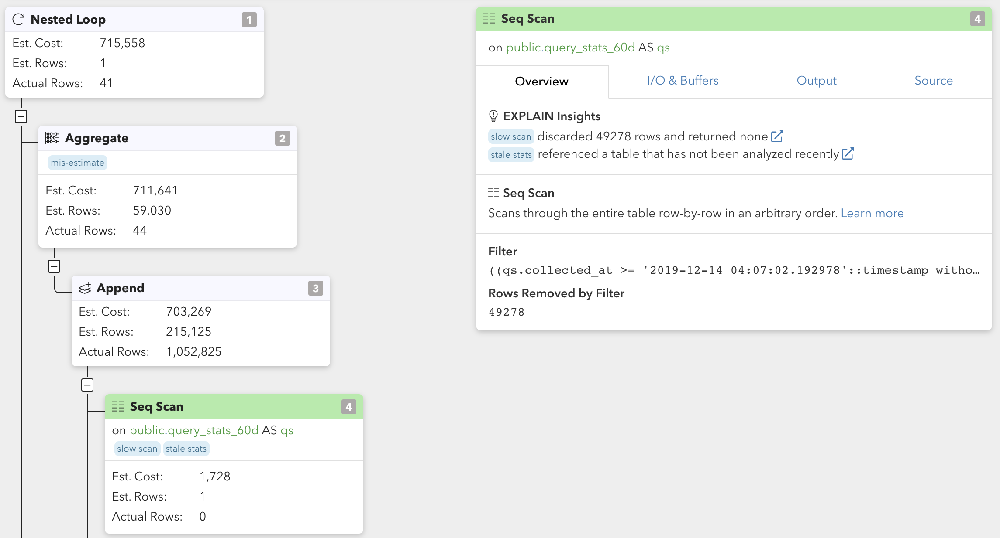

First time looking at **EXPLAIN**, or trying to understand how query plans work?

Start here: **[The Basics of Postgres Query Planning](/docs/explain/basics-of-postgres-query-planning)**

## pganalyze EXPLAIN Insights

Wondering how you should optimize a particular query?

pganalyze automatically collects queries using **[auto_explain](/docs/log-insights/setup/auto_explain)** and
analyses query execution plans to find the most important insights:

* [Disk Sorts](/docs/explain/insights/disk-sorts)
* [Expensive](/docs/explain/insights/expensive)
* [Hash Batches](/docs/explain/insights/hash-batches)
* [Inefficient Index](/docs/explain/insights/inefficient-index)
* [Large Offset](/docs/explain/insights/large-offset)
* [Lossy Bitmaps](/docs/explain/insights/lossy-bitmaps)
* [Mis-Estimate](/docs/explain/insights/mis-estimate)
* [Slow Scan](/docs/explain/insights/slow-scan)
* [Stale Stats](/docs/explain/insights/stale-stats)

## Postgres Plan Nodes

Understanding the behavior and performance of individual plan nodes (and when Postgres chooses them for a plan) is critical to understanding overall query planning.

Node types can be broadly considered in three categories:

* [Scan nodes](/docs/explain/scan-nodes): Produce rows from underlying table data
* [Join nodes](/docs/explain/join-nodes): Combine rows from child nodes
* [Other nodes](/docs/explain/other-nodes): Broad variety of functionality (e.g. aggregation, limiting, grouping, etc)

## Query Plan Visualization

pganalyze includes built-in visualization of query plans:

Visualizations are available for all plans collected using [auto_explain](/docs/log-insights/setup/auto_explain).