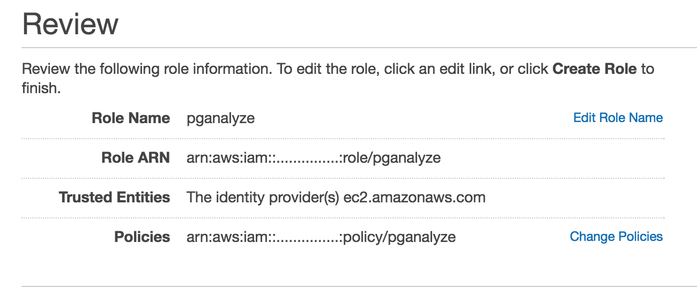

For this final step, you first need to choose whether you want to install the collector<br>
on an existing EC2 instance, or run a new one.

The collector is a daemon process that continuously collects database statistics as well<br>
as other information from the RDS system, and submits them to the pganalyze dashboard<br>
in recurring intervals.

Historically the pganalyze collector has been Python-based (invoked via cron), but for RDS access<br>
you need to use our [newer Go-based collector](https://github.com/pganalyze/collector) which runs as a daemon.

You can either run it on a tiny instance (a `t2.nano` suffices), or add it to an existing EC2 instance in your environment.

## Variant A: Starting a new EC2 instance

First, go back to **Security Credentials** and create a new IAM role that can be used by EC2 instances,<br>
with the IAM policy that we created in the previous step.

It should look like this when reviewing:



Start a new `t2.nano` instance, Amazon Linux based, that has this role applied:


Then follow the step to install the collector on Amazon Linux based instances.

## Variant B: Giving access to an existing EC2 instance

In case you'd like to use an existing EC2 instance, there are two approaches you can choose:

1. Add the IAM policy we created to your existing instance role
2. Create a new IAM user, and manually supply the credentials (using the `aws_access_key_id` and `aws_secret_access_key` config options)

If you know AWS a bit these should be straightforward to configure. Please reach out in case you run into issues.

## Installing the collector on the instance

SSH into your EC2 instance, and run the following to download and install the package:

<div><docs-collector-install default-tab="yum"></docs-collector-install></div>

## Configure the collector

The collector configuration file lives in `/etc/pganalyze-collector.conf`, and looks like this:

```
[pganalyze]
api_key: your_pga_api_key
db_host: yourdb.company.com
db_name: your_database_name
db_username: your_database_user
db_password: your_database_password
aws_db_instance_id: your_rds_instance_id
```

Fill in the values step-by-step:

1. The `api_key` can be found in the pganalyze dashboard (on the API Keys page for your organization)
2. The `db_host` is the hostname of your RDS instance
3. The `db_name` is the database on the PostgreSQL server you want to monitor
4. The `db_username` and `db_password` should be the credentials of the monitoring user we created in Step 2 (or of a superuser, if you'd like)
5. The `aws_db_instance_id` is the name shown as `DB Instance` or `DB Instance Identifier` in the AWS console (usually chosen when you create the RDS instance)

In case you are not in `us-east-1` you will also need to add `aws_region` and set it to e.g. `ap-southeast-1`

Also, in case you'd like to use an IAM user instead of the instance role, you'll need to supply `aws_access_key_id` and `aws_secret_access_key`.

There are a few more advanced options, as well as the ability to specify multiple databases - see a more complex [example file](https://gist.github.com/lfittl/475cbd3d39a0a79959fb15b2871db73a).

## Test run

You can verify that the configuration is correct, by running the following command:

```
pganalyze-collector --config=/etc/pganalyze-collector.conf --test
```

This will go through one cycle of collecting statistics information from both PostgreSQL and RDS,<br>
as well as submitting it to the pganalyze dashboard (but not storing it).

If this is successful, all you should see is:

```
1999/01/01 08:04:32 I [pganalyze] Test submission successful (1010 KB received) - proceed running the collector as a daemon
```

Note that in some error cases the collector might still succeed - try to debug them nonetheless, or reach out to us for help.

In case the collector can't find the instance make sure that you've specified the correct `aws_db_instance_id` and `aws_region`.

## Reloading the daemon

If you've installed the package successfully, the daemon should have been running in the background already,<br>
You can now issue a simple reload to get it to update its configuration:

```
sudo service pganalyze-collector reload
```

You can verify that the collector is running using `service pganalyze-collector status`, this should return something like:

```
pganalyze-collector (pid  2395) is running...
```

The collector will also log every time data is sent to syslog/journald, which you can typically find in /var/log/messages or /var/log/syslog:

```
1999/01/01 15:50:03 I [pganalyze] Submitted snapshot successfully
1999/01/01 16:00:04 I [pganalyze] Submitted snapshot successfully
1999/01/01 16:10:13 I [pganalyze] Submitted snapshot successfully
1999/01/01 16:20:04 I [pganalyze] Submitted snapshot successfully
```

The dashboard should start showing data once at least two snapshots have been received from the collector daemon.

It is recommended you let the system run for 24 hours before giving it a detailed look, most views need a few<br>
hours worth of data to show correctly and give you useful insights.
