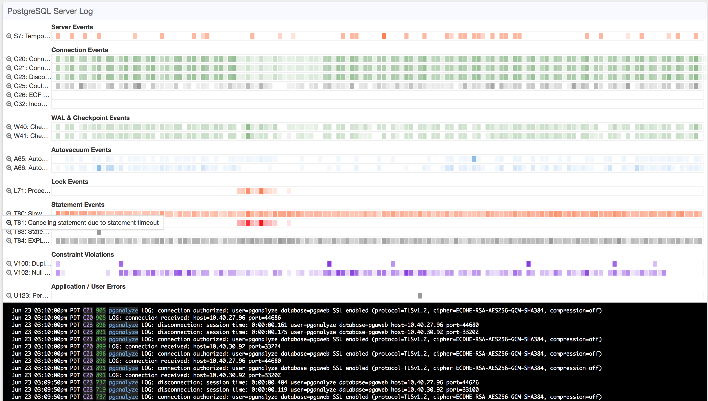

In order to configure Log Insights for Amazon RDS and Amazon Aurora, please first
make sure that you have setup the IAM policy as described in the RDS installation guide.

Note that you will also need to be on the **Scale** plan, or be in your 14-day trial period.

Finally, please make sure you are on the most recent collector release by checking whether
your pganalyze collector package is up to date.

## 1. Add enable_logs setting to pganalyze-collector.conf

The collector will only collect log data when `enable_logs: 1` is added to your
configuration file, so it looks like this:

```
[pganalyze]
api_key: your_api_key

[server1]
db_name: mydb
db_username: myusername
db_password: mypassword
db_host: 127.0.0.1
db_port: 5432
aws_db_instance_id: your_rds_instance
aws_region: us-west-2
aws_access_key_id: mykey
aws_secret_access_key: mysecret
enable_logs: 1
```

## 2. Test log download

Now you can test whether the collector can actually access your RDS logs correctly,
by running the following:

```
pganalyze-collector --test
```

If this works correctly you will see output like this:

```
```

## 3. Reload the collector

In order to make this change permanent, reload the collector:

```
pganalyze-collector --reload
```

You will then see Log Insights data on your database within a few minutes:



We recommend that you also
[tune a few configuration parameters](/docs/log-insights/setup/tuning-log-config-settings)
to get useful log output from Postgres.
